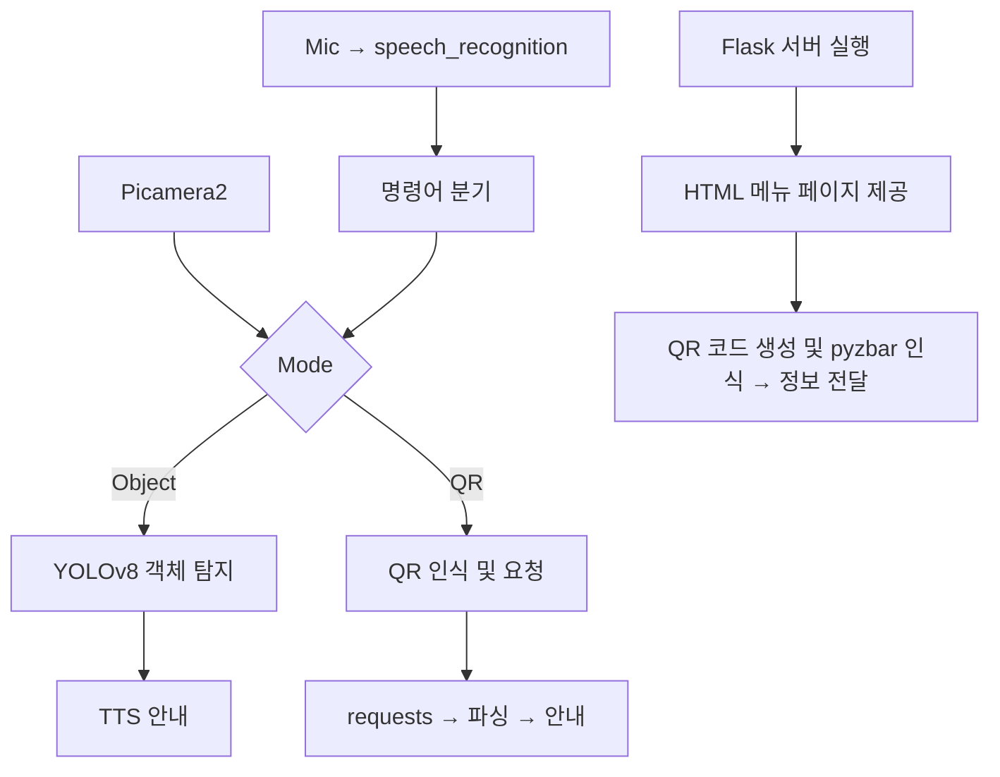

# 🦾 Smart Vision: AI 기반 실시간 장애물 인식 보조 시스템


---

## 📘 프로젝트 소개

Smart Vision은 라즈베리파이5 기반으로 YOLOv8 객체 탐지, QR 코드 인식, TTS 음성 안내, 음성 명령 제어 등 다양한 기능을 통합한 실시간 사용자 보조 시스템입니다. 시각장애인이나 정보 접근이 어려운 사용자에게 실생활에서 안전성과 접근성을 제공합니다.

또한 Flask 서버(`qrserver.py`)를 통해 QR 코드 접속용 웹페이지를 제공하고, 그에 대한 QR 이미지를 자동 생성합니다. `traffi5.py`와 함께 병렬 실행되어 QR 기반 콘텐츠와 객체 인식 기능이 함께 작동합니다.

---

## 🧩 사용된 기술 스택

- **YOLOv8n (Ultralytics)** – 실시간 객체 탐지
- **gTTS + pygame** – 텍스트 음성 변환 및 오디오 재생
- **speech_recognition** – 한국어 음성 명령 인식
- **pyzbar + OpenCV** – QR 코드 인식 및 디코딩
- **requests + BeautifulSoup4** – QR 링크 텍스트 파싱
- **Picamera2 + threading** – 영상 입력 및 병렬 처리
- **datetime / OS thermal API** – 시간 안내 및 CPU 온도 모니터링
- **Flask** – 로컬 웹서버 구동 (메뉴 안내 페이지)
- **qrcode** – QR 코드 생성

---

## 🛠 주요 기능

### 🔎 객체 인식 모드 (`traffi5.py`)
- 카메라 영상을 YOLOv8으로 분석하여 위험 객체(사람, 차량 등)를 인식
- 방향(왼쪽/정면/오른쪽) 계산 후 한국어 음성으로 안내

### 📷 QR 코드 모드
- QR 코드 인식 → URL 접속 → 텍스트 추출 → 실시간 음성 안내

### 🛰 Flask 서버 동작 (`qrserver.py`)
- QR 링크 접속용 로컬 웹페이지 제공 (예: 오늘의 메뉴)
- `generate_qr()` 함수로 QR 이미지 생성 및 저장

### 🎙 음성 명령 제어
- 명령어: "객체", "큐알", "온도", "시간", "다시 안내", "종료"
- `speech_recognition`을 이용하여 키워드 분기 처리

### 🌡 CPU 온도 안내
- `/sys/class/thermal/thermal_zone0/temp`로 온도 측정
- 음성으로 현재 CPU 온도 안내

### 🕒 현재 시간 안내
- `datetime.now()`로 한국어 포맷 시각 안내

---

## 🧠 시스템 흐름도



---

## ⚙️ 설치 및 실행 방법

### 라즈베리파이5 세팅
```bash
sudo apt update && sudo apt install -y libcamera-apps python3-picamera2
```

### 필수 패키지 설치
```bash
pip install ultralytics gtts pygame speechrecognition pyzbar requests beautifulsoup4 opencv-python flask qrcode
```

### YOLO 모델 다운로드 (경량화 모델)
```python
from ultralytics import YOLO
model = YOLO("yolov8n.pt")
```

### 실행 (traffi5.py + qrserver.py)
```bash
# 터미널 1
python qrserver.py

# 터미널 2
python traffi5.py
```

---

## 🎮 명령어 요약표

| 명령어       | 기능 설명                           |
|--------------|------------------------------------|
| "객체"        | 객체 탐지 모드 전환                  |
| "큐알"        | QR 코드 모드 전환                    |
| "온도"        | 현재 CPU 온도 음성 안내              |
| "시간"        | 현재 시간 음성 안내                  |
| "다시 안내"   | 마지막  메시지 재생              |
| "모드     "   | 현대 모드 메시지  재생              |
| "종료"        | 프로그램 종료                        |

---

## 📂 폴더 구조

```
SmartVision/
├── traffi5.py
├── qrserver.py
├── models/
│   └── yolov8n.pt
├── assets/
│   ├── demo.gif
│   └── screenshots/
├── qr_link.png
├── README.md
└── requirements.txt
```

---

## 🚀 향후 개선 방향

- 오프라인 TTS 모델 적용 (e.g., RHVoice)
- 객체 거리 예측 및 충돌 위험 감지
- 다국어 음성 안내 시스템 통합
- YOLO 모델 TensorRT 최적화
- GUI 기반 모드 선택 및 피드백 시스템
- QR 콘텐츠 자동 변환 기능 추가

---

## 👨‍💻 개발자 정보

- **박성주 (Park Sungjoo) Shim_0486@naver.com**
- **이성택 (Lee Seong Taek) dltjdxor0407@naver.com**

---

## 📄 라이선스
본 프로젝트는 **대학교 캡스톤디자인 과목의 일환**으로 진행되었으며, 저작권은 공동 개발자인 **박성주(Park Sungjoo)**와 **이성택(Lee Seong Taek)**에게 있습니다. 외부 사용 시 출처를 명시해 주세요.

> 본 시스템은 라즈베리파이5에서 테스트되었으며, 실시간 음성 및 영상 처리를 위한 최적화가 필요합니다.

